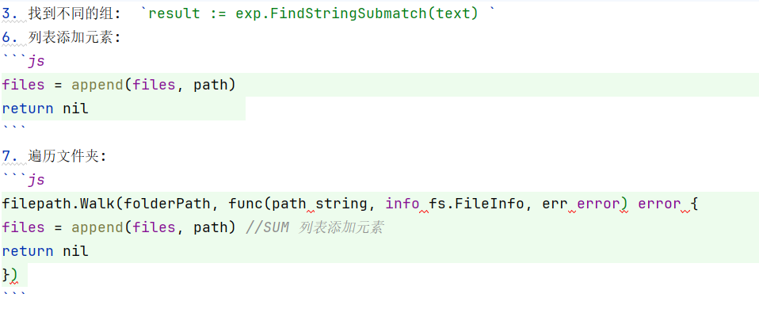

# CodeSummaryer
## 简介（Description）
使用简单的符号，把你标记的代码段转化成markdown格式，方便日后查看。  
## 使用方法（How To Use）
- 在默认配置下，使用`//SUM`对代码进行“行注释”，和平常添加注释一样。可以使用`//SUM`和`//SUMEND`匹配来进行多行标记，也可以进行嵌套标记，但注意：多行嵌套标记中有一个`//SUM`就需要一个`//SUMEND`来进行匹配，否则会提取不正确。单行注释和多行注释的代码解释都需要写在`//SUM`后面。下面为两个实例代码：  

```js
result := exp.FindStringSubmatch(text) //SUM 找到不同的组
```
```js
filepath.Walk(folderPath, func(path string, info fs.FileInfo, err error) error { //SUM 遍历文件夹
		files = append(files, path) //SUM 列表添加元素
		return nil                  //SUMEND
	}) //SUMEND
```
上述代码经过CodeSummaryer转换后成为如下的markdown格式：


- 使用`-h`命令查看帮助（Use `-h` find Help）
```
  -c string
        创建该工具的配置模板(Json格式)
        Create a JSON Config File
  -d string
        指定要进行代码总结的文件夹路径 (default ".")
        Specify the folder path for code summary
  -j string
        使用指定json文件中的配置
        Use the configuration in the specified JSON file
  -o string
        指定结果保存文件
        Specify Result Save Path
```
- 最简单的使用（Really Simple Use）   
`go run main.go -o 1.md`   或者     
`Summary -o "1.md"`   
使用该命令对当前所在的目录下文件（包括子目录下的文件）进行总结，将标记了的代码写入到当前目录的`1.md`文件  
- 根据提示使用其他命令进行更加详细的操作   

## 手动编译（Compile）
1. `go build -o Summary.exe main.go`
2. 将`Summary.exe`放到系统环境命令下（你可以选择其他名字，这需要在`1.`中修改`-o`的参数）。
